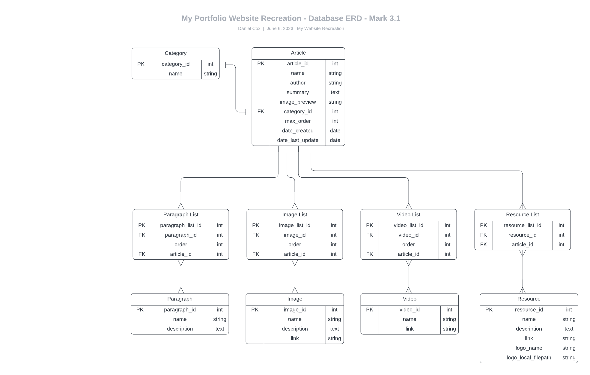

# My Portfolio Website Recreation Backend

Welcome to the backend repo for my portfolio website creation.

## About
This backend repo is the Django Python Web Framework with the Django REST Framework to create a REST API for a backend database of the CRUD (Create, Read, Update, Delete) functionally.

## Backend Resource  
### My ERD
### 

### [HTTP Calls Plan](Plans/backendPlanMark4.0.txt)

### [My Website Recreation Project Board](https://github.com/users/DangerousDaniel/projects/3)

## Framework Resources
### [Django](https://www.djangoproject.com/) 
### [Django REST Framework](https://www.django-rest-framework.org/)

## Term and Conditions
This backend repo is a portfolio piece for my website recreation. You may read the code, and use it in other repos as long as you modify it for your needs. You may test out the REST API by a fork and cloned down the repo to your computer. This repo is owned by Daniel Cox and copyright under the standard copyright license.

